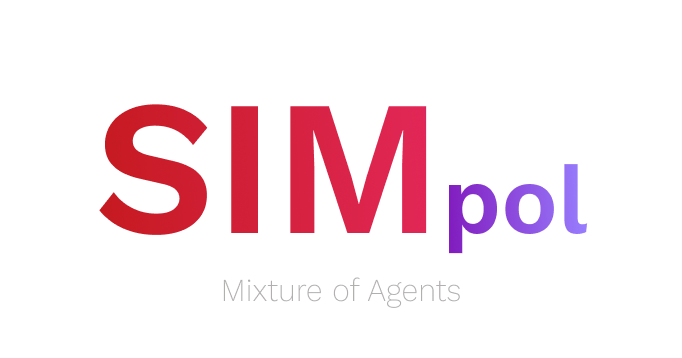

# Mixture of Agents: AI Workbench Application for Public Policy Research and Execution (SIMpol)

## Pipeline Workflow

- Thoughts are generated from the user’s question using a lightweight local llama3.1:8b model. *(The model is finetuned to both write thoughts to aid the final response generation but also to create prompts according to these thoughts.)* 
- The stream of text thoughts is passed to the user, and the prompts are passed to the relevant Agents.
- Agents are usually ran on a capable local model which supports tool calling (Qwen2.5:14b) or a specialised local model (Qwen2.5 Coder:14b / 32b for programming).

## User Experience

First the user's question is passed to the LLM to generate thoughts. (Inspiration: [An AI generates text thoughts](https://www.youtube.com/watch?v=rmEmsZmlvNo&t=969s))

The thoughts are comprised of a text response and a set of prompts which are passed to the Agents.

While the Agents work on the prompts, the user is streamed the text response which gives the user a sense of progress. The user can also see the Agents working on the prompts.

This is just the start of the process, the Agents return their results which are progressively displayed to the user as artifacts.

Then comes the itterative process, where the user can control each Agent output with further prompts. The user can refine the current artifact, go back to the previous step or add an agent to the deliberative process either with prompts suggested by the thinking LLM or a new question.

__Starter Agents are responsible for different tasks, such as:__

-  Calculator related tasks (most maths, analysis, stats, formulas evaluated through python libraries)
-  Data Visualization (Text, File System, Video, Images, Audio, Charts, Tables)
- Information Retrieval (Web, Files, SQL Databases, other databases might require a Connector Agent)
- Code Generation (access to an appropriate code interpreter, itterative loop for code generation, can also be called by other Agents)

## Agent Expansion

These Agents can be expanded with custom Agents that are responsible for specific skillsets.

#### Let's say you work in city planning. You would create an Agent solely responsible for rendering maps. 

It would know the challenges of rendering maps (strategies for high polygon count), throw the weeks of using it you would have taught it the main features of your city it and would be able to call the appropriate Agents to get complementary data.